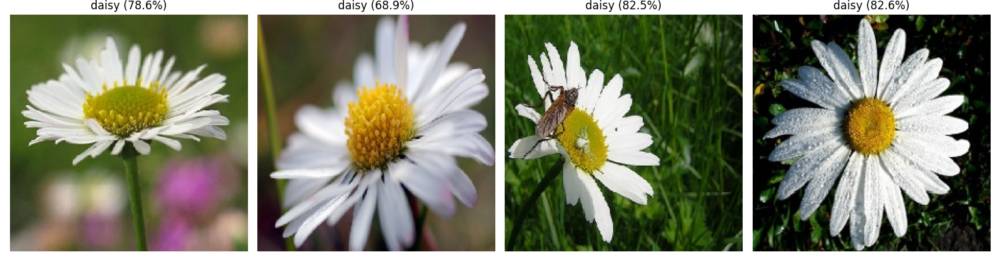
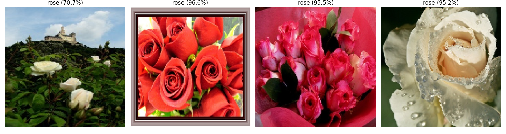
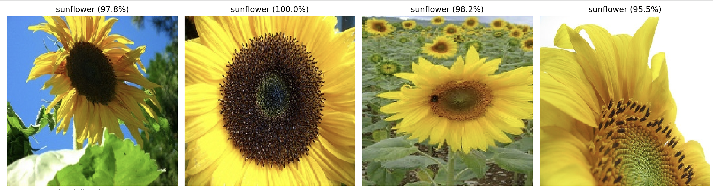

# Image-Recognition
CNN is used for image recognition
#  Flower Recognition using CNN

This project uses a Convolutional Neural Network (CNN) built with TensorFlow and Keras to classify different species of flowers. The model was trained on the popular Kaggle Flower Dataset, and this repository documents experiments with adding new convolutional layers to improve performance.

***

##  Table of Contents
- [Dataset](#-dataset)
- [Project Structure](#-project-structure)
- [Installation](#-installation)
- [Usage](#-usage)
- [Prediction Results](#-prediction-results)

***

##  Dataset

The model was trained on the **Flowers Recognition** dataset from Kaggle. This dataset contains over 4,000 images of flowers divided into five classes: daisy, dandelion, rose, sunflower, and tulip.

You can download the dataset from here:
* **Kaggle:** [Flowers Recognition Dataset](https://www.kaggle.com/datasets/alxmamaev/flowers-recognition)

***

##  Project Structure

The repository is organized as follows:
```
IMAGE-RECOGNITION/

├── .gitignore
├── README.md
├── requirements.txt
├── data/
│   └── (Images from Kaggle dataset go here)
├── results/
│   ├── accuracy/
│   └── predictions/
│       ├── daisy646432.png
│       └── ...
├── saved_models/
│   ├── flower_classifierallnewlayer6_...
│   └── ...
└── src/
├── flower1.py      # Main training script
└── prediction.py   # Script to run predictions
```

***

## ⚙️ Installation

To get this project running on your local machine, follow these steps:

1.  **Clone the repository:**
    ```bash
    git clone <your-repository-url>
    cd IMAGE-RECOGNITION
    ```

2.  **Install dependencies:**
    Make sure you have Python and Pip installed. Then, install the required packages.
    ```bash
    pip install -r requirements.txt
    ```

3.  **Set up the data:**
    Download the dataset from the Kaggle link above. Unzip the file and place the contents (folders for each flower type) into the `data/` directory.

***

##  Usage

#### Training
To train a new model or replicate the experiments, run the main training script. This script will train the model and save the weights in the `saved_models/` directory.
```bash 
python src/flower1.py
```

#### Prediction
To make a prediction on a new image, use the prediction.py script. This will load one of the pre-trained models from saved_models/ and classify the image, you can make the necessary changes as requires for testing your image.

```bash 
python src/prediction.py 
--image_path /path/to/your/image.jpg
```

## Prediction Results
After training a model with additional convolutional layers (flower_classifierallnewlayer6_...) a combination of layers 32, 64, 128, 64, 64, 32 followed by dense layer gave the accurate predictions with epochs = 35, it was tested on sample images. The predictions of this testing are stored in the results/predictions directory.

Here are some examples of the model's predictions.

| Predicted: Daisy | Predicted: Rose | Predicted: Sunflower |
| :---: | :---: | :---: |
|  |  |  |